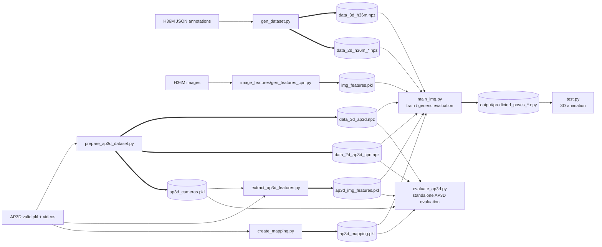
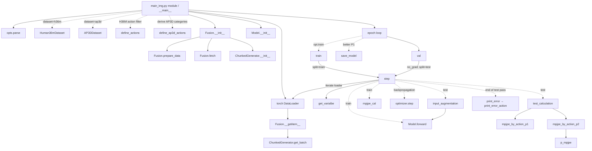
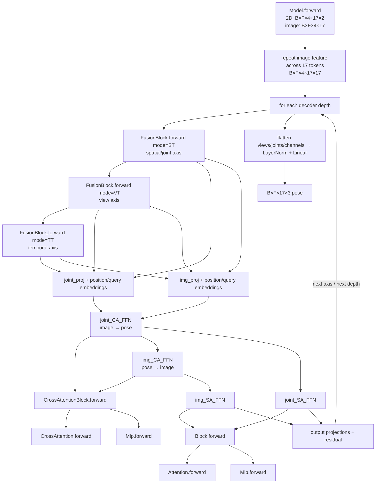
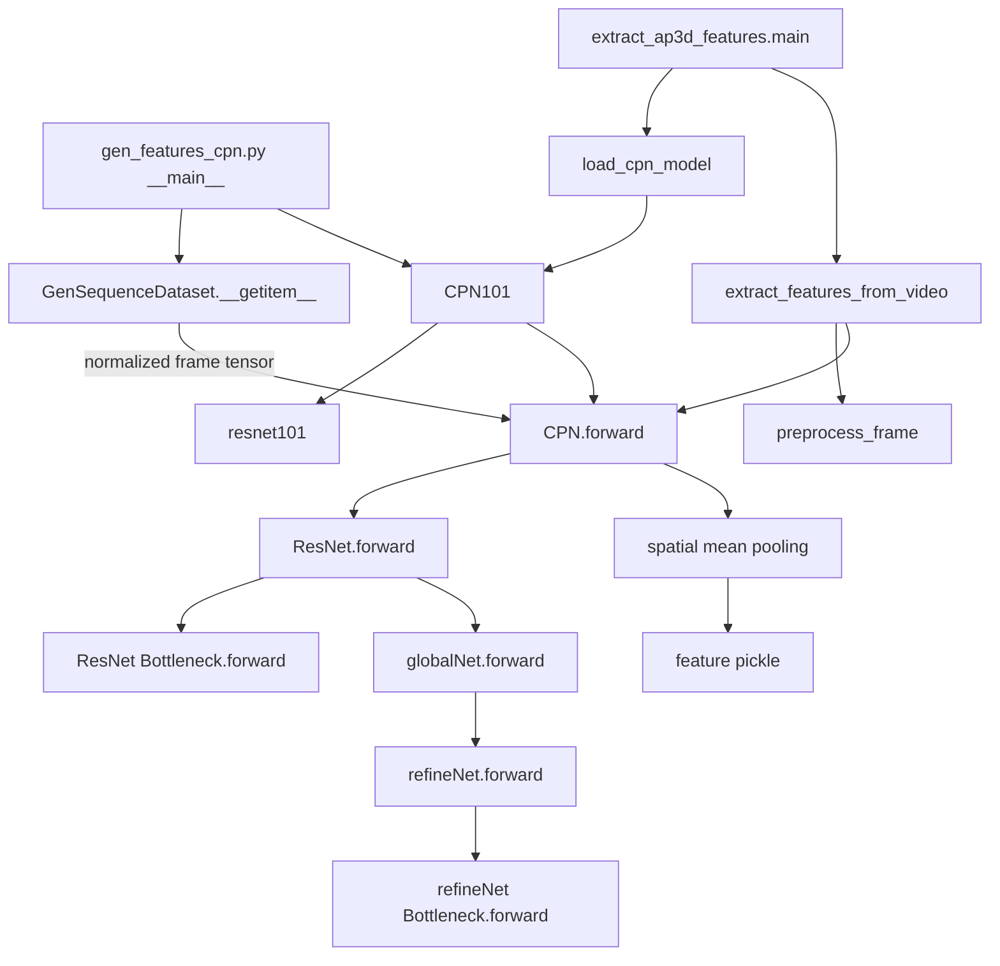
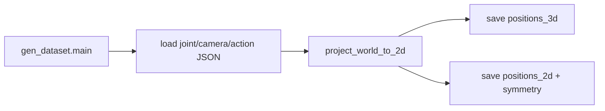
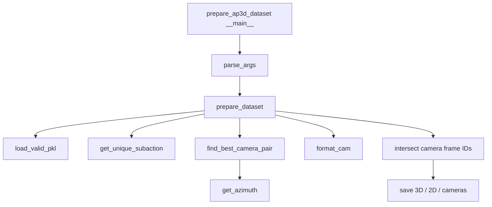
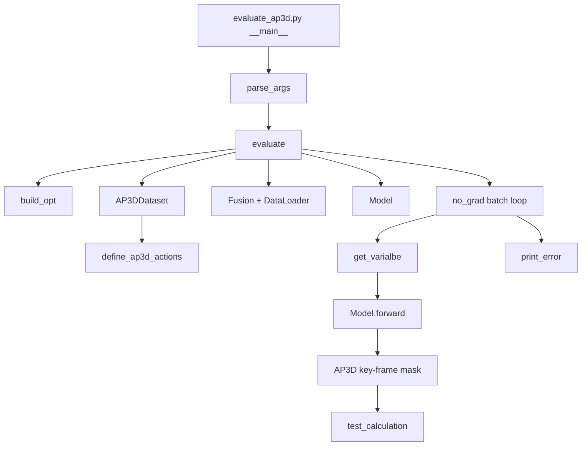

# DSVTformer callgraph

This document describes the repository's runtime callgraph. It focuses on
project-defined functions and classes; routine calls into PyTorch, NumPy,
OpenCV, matplotlib, and the Python standard library are described at the
boundary instead of expanding those libraries internally.

## How to read the graphs

- `A --> B : label` means **A calls or constructs B**. The label explains why
  the call is made and what data crosses the edge.
- `A -.-> B` is a conditional edge.
- `A ==> artifact` writes an artifact; `artifact ==> A` reads one.
- A class node such as `Fusion` includes its constructor unless a method is
  shown explicitly.
- PyTorch invokes `module.forward(...)` through `module(...)`; those edges are
  shown as calls to `forward`.

## 1. Top-level system/dataflow graph

### Nodes

| Node | Functionality |
|---|---|
| `gen_dataset.py` | Converts H36M JSON joints and camera calibration into the repository's 3D and multi-view 2D NPZ layout. |
| `image_features/gen_features_cpn.py` | Reads H36M frames, runs frozen CPN, spatially pools its final heatmap, duplicates two physical cameras into four logical views, and writes per-frame image features. |
| `prepare_ap3d_dataset.py` | Synchronizes AP3D cameras, chooses camera pairs from `camera_choice.csv`, pads two views to four, and writes 2D, 3D, and camera data. |
| `extract_ap3d_features.py` | Reads synchronized AP3D video frames and extracts the same pooled CPN features used by the main model. |
| `create_mapping.py` | Connects AP3D subaction names to CSV motion/camera names so evaluation can apply key-frame masks. It executes `get_mapping()` immediately when imported or run. |
| `main_img.py` | Primary training and generic evaluation program. Builds data loaders and DSVTformer, trains with MPJPE, evaluates with P1/P2, saves checkpoints and raw predictions. |
| `evaluate_ap3d.py` | Evaluation-only AP3D driver with its own option proxy and the same dataset/model/metric stack. |
| `test.py` | Loads one saved prediction array and animates the 17-joint skeleton. |

### Edges

The preparation-to-artifact edges serialize aligned modalities. The
artifact-to-training edges load 3D supervision, 2D poses, image-context
features, camera metadata, or AP3D masks. `main_img.py ==> predicted_poses`
serializes model output during every test batch; `predicted_poses --> test.py`
loads one of those arrays for display.

## 2. Primary training and evaluation callgraph

### Nodes

| Node | Functionality |
|---|---|
| `opts.parse` | Defines CLI arguments, turns `--test` into `train=0`, computes temporal padding, chooses subject splits, and creates a timestamped checkpoint directory during training. |
| `Human36mDataset` | Loads H36M 3D positions and calibrated cameras, normalizes camera intrinsics, and exposes subjects/actions through `MocapDataset`. |
| `AP3DDataset` | Loads AP3D positions and per-action cameras. It supports two physical views padded as `[A,B,A,B]`. |
| `define_actions` | Resolves `*`/`all` or one H36M action into evaluation categories. |
| `define_ap3d_actions` | Scans the AP3D dataset and removes trailing numeric suffixes to form metric categories. |
| `Fusion.prepare_data` | Root-centers 3D poses, loads 2D poses and image features, removes missing sequences, length-aligns all modalities, normalizes 2D coordinates, and stacks camera lists into `[frame,view,...]` arrays. |
| `Fusion.fetch` | Re-keys each aligned sequence by `(subject, action)` for the chunk generator. Camera parameters are intentionally returned as `None`; the model is calibration-free. |
| `ChunkedGenerator.__init__` | Creates temporal sample descriptors `(sequence,start,end,flip,reverse)` and records sequence index ranges. |
| `Fusion.__getitem__` | Resolves one descriptor to tensors and metadata. In test mode it adds a leading augmentation axis, although both copies are currently identical. |
| `ChunkedGenerator.get_batch` | Slices a temporal window, edge-pads boundary frames, and returns aligned 3D, 2D, image-feature, subject, action, and range values. |
| `get_varialbe` | Converts batch tensors to CUDA float tensors. The misspelling is the actual API name. |
| `train` / `val` | Thin mode-specific wrappers over `step`; `val` also disables gradient recording. |
| `step` | Shared batch loop. It switches model mode, moves data, runs inference, computes loss or metrics, applies AP3D key-frame masks, and aggregates results. |
| `input_augmentation` | Selects test tensor copy `input_2D[:,0]` and calls the model. It does not currently flip or ensemble predictions. |
| `mpjpe_cal` | Mean Euclidean joint distance; used as the training objective. |
| `test_calculation` | Updates both P1 and P2 per-action accumulators. |
| `mpjpe_by_action_p1` | Computes raw MPJPE and groups samples under normalized action names. |
| `mpjpe_by_action_p2` | Converts tensors to NumPy, calls Procrustes-aligned MPJPE, and groups results by action. |
| `p_mpjpe` | Performs per-pose similarity alignment (translation, rotation, scale) before measuring error. |
| `print_error_action` | Prints per-action errors in test mode and returns the unweighted mean over action categories. |
| `save_model` | Deletes the previously tracked best checkpoint and saves the new best `state_dict`. |

### Edges

| Edge | Meaning |
|---|---|
| `__main__ → opts.parse` | Parse global runtime configuration before model import/construction. |
| `__main__ → Human36mDataset/AP3DDataset` | Select and load the requested 3D dataset and camera metadata. |
| `__main__ → Fusion → prepare_data/fetch/ChunkedGenerator` | Convert persistent files into aligned temporal sample descriptors. This chain runs once for train and once for test when training is enabled. |
| `DataLoader → Fusion.__getitem__ → get_batch` | Worker processes materialize each descriptor as one aligned sample. |
| `epoch loop → train/val → step` | Reuse one batch engine, with mode and gradient behavior selected by `split`. |
| `step → get_varialbe` | Transfer all numeric modalities to the active CUDA device. |
| `step → Model.forward` | Training passes the regular 2D tensor; testing reaches the same model through `input_augmentation`. |
| `step → mpjpe_cal → optimizer.step` | Training compares predicted and root-zeroed ground truth, backpropagates, then updates weights. |
| `step → test_calculation → P1/P2` | Evaluation center-selects the temporal prediction, root-centers it, optionally filters AP3D frames, and accumulates both protocols. |
| `P2 → p_mpjpe` | Protocol 2 requests similarity alignment before error measurement. |
| `step → print_error` | Finish an evaluation pass by reducing per-action accumulators. |
| `epoch loop → save_model` | Persist a checkpoint only when P1 improves. |

## 3. DSVTformer forward callgraph

### Nodes

| Node | Functionality |
|---|---|
| `Model.forward` | Validates shared batch/frame/view dimensions, turns each per-view 17-value image vector into 17 identical image tokens, runs `depth` spatial-view-temporal stages, and regresses 3D joints. |
| `FusionBlock.forward(ST)` | Rearranges each view to make the 17 joints the token axis and folds time into each token's channels; learns spatial joint relations. |
| `FusionBlock.forward(VT)` | Rearranges each frame to make the four views the token axis and folds joints into channels; learns cross-view relations. |
| `FusionBlock.forward(TT)` | Rearranges each view to make frames the token axis and folds joints into channels; learns temporal relations. |
| `joint_proj` / `img_proj` | Map the current pose and image token features to mode-specific embedding dimensions. |
| `joint_CA_FFN` | Uses pose queries/keys with image values: image-to-pose cross-modal transfer. |
| `img_CA_FFN` | Uses image queries/keys with the just-updated pose values: pose-to-image transfer. The ordering makes the exchange directional and sequential. |
| `CrossAttentionBlock.forward` | Normalizes Q/K/V, adds multi-head cross-attention residually, then optionally adds an MLP residual. |
| `CrossAttention.forward` | Projects Q/K/V, computes scaled dot-product attention across the mode's token axis, mixes values, and projects to the query dimension. |
| `joint_SA_FFN` / `img_SA_FFN` | Independent same-modality transformer blocks after cross-modal exchange. |
| `Block.forward` | Adds normalized self-attention and MLP residual branches. |
| `Attention.forward` | Standard multi-head scaled dot-product self-attention. |
| `Mlp.forward` | Two linear layers with GELU and dropout; supplies transformer feed-forward branches. |
| output projections/residual | Return embedded streams to their original mode dimensions. The first depth replaces inputs; later depths add residuals. |
| model head | Flattens four per-view 3D pose estimates for every frame and maps `4×17×3` values to one `17×3` pose. |

### Edges

Within every fusion block, both streams first reach their projections. Their
embeddings feed `joint_CA_FFN`, whose updated pose output then feeds
`img_CA_FFN`. Each updated stream next enters its own `Block`. Output
projections restore the five-dimensional stream layouts, enabling the strict
`ST → VT → TT` edge order and then the next decoder depth. After the final
depth only the pose stream reaches the regression head; the image stream is
conditioning state and is discarded.

## 4. CPN image-feature callgraph

### Nodes

| Node | Functionality |
|---|---|
| `GenSequenceDataset` | Indexes H36M JSON image metadata, reads and ImageNet-normalizes frames, and returns frame identity with each tensor. |
| `extract_features_from_video` | Reads only requested synchronized AP3D frames, fills missing frames with the last valid image, batches preprocessing/inference, and returns pooled features. |
| `preprocess_frame` | Resize to `288×384`, BGR→RGB, scale, ImageNet-normalize, and transpose to channel-first. |
| `load_cpn_model` | Constructs CPN-101, loads a checkpoint after removing `module.` prefixes, moves it to a device, and switches to evaluation mode. |
| `CPN101` | Factory that constructs a ResNet-101 backbone and wraps it with global/refinement pose heads. |
| `ResNet.forward` | Produces four feature maps, coarse-to-fine `[x4,x3,x2,x1]`. |
| `ResNet.Bottleneck.forward` | Residual convolutional unit used throughout the backbone. |
| `globalNet.forward` | Top-down lateral feature pyramid; returns intermediate feature maps and one heatmap prediction per scale. |
| `refineNet.forward` | Upsamples/cascades all global feature maps, concatenates them, and predicts refined 17-joint heatmaps. |
| `refineNet.Bottleneck.forward` | Residual unit used in the refinement cascades. |
| spatial mean pooling | Averages the final refined heatmap over height and width, producing 17 image-context values per frame/view. |

### Edges

Both H36M and AP3D pipelines converge on `CPN.forward`. CPN calls the backbone,
passes its four maps through `globalNet`, then sends the returned global feature
maps to `refineNet`. The callers select the final tuple element
(`refine_out`) and spatially average it. This explains the main model's hard
coded `img_in_ratio = 17`.

## 5. Dataset-preparation callgraphs

### H36M

- `gen_dataset.main` discovers subject files, maps action/subaction IDs to
  names, skips the known corrupt S11 `Directions 2`, preserves 3D sequences,
  and projects each sequence into four configured views.
- `project_world_to_2d` transforms world points into camera coordinates, guards
  zero depth, and applies pinhole focal length/principal point projection.
- `main → project_world_to_2d` occurs once per subject/action/camera and passes
  3D joints plus `R,t,f,c`. The save edges collect those results into the NPZ
  schema consumed by `Human36mDataset` and `Fusion`.

### AP3D

| Node | Functionality |
|---|---|
| `load_valid_pkl` | Loads AP3D validation records. |
| `get_unique_subaction` | Normalizes subject-specific AP3D filename conventions into stable sequence keys. |
| `get_azimuth` | Derives horizontal viewing angle from a camera rotation matrix. |
| `find_best_camera_pair` | Searches all camera pairs for separation closest to 90°. This result is printed, while the later CSV mapping determines the actual per-subaction pair written. |
| `format_cam` | Converts AP3D calibration into the H36M-style camera dictionary, including matrix-to-quaternion conversion. |
| synchronization step | Intersects the two selected cameras' frame IDs, gathers 2D joints and camera-space 3D ground truth, and duplicates `[A,B]` into `[A,B,A,B]`. |

`prepare_dataset → find_best_camera_pair → get_azimuth` is the geometric
selection chain. Separately, `prepare_dataset` reads `camera_choice.csv` and
maps ordered subactions to explicit camera pairs; those pairs drive
`format_cam` and synchronization. The three save edges write aligned NPZ
modalities and per-action camera dictionaries.

### AP3D mapping

`create_mapping.py` calls `get_mapping()` at module scope. `get_mapping`
normalizes and sorts names from `camera_choice.csv`, loads `valid.pkl`, calls
its nested `get_unique_subaction` for every record, aligns occurrences by
category and numeric suffix, then writes `data/ap3d_mapping.pkl`. Evaluation
uses that artifact to locate subject/motion/camera-specific key-frame arrays.

## 6. Standalone AP3D evaluation

`build_opt` adapts standalone CLI arguments to the attributes expected by
`Fusion`. `evaluate` loads the dataset and checkpoint, constructs the same
DSVTformer used by training, selects the center frame and makes predictions
root-relative, builds a mask from `ap3d_mapping.pkl` and `key_frames/`, then
reuses the common P1/P2 metric chain. Unlike `main_img.step`, it does not save
each prediction batch.

## 7. Visualization callgraph

`test.py` executes setup at module scope: it loads a prediction, calculates
fixed 3D plot bounds, creates joint and bone artists, and constructs
`matplotlib.animation.FuncAnimation`. During display, `FuncAnimation → update`
once per frame. `update` reads the frame's joint coordinates, moves the scatter
artist, updates every skeleton edge, changes the title, and returns the
artists.

## 8. Supporting nodes and currently inactive code

These definitions are part of the codebase but are not reached by the normal
entry points above:

| Node | Functionality / caller |
|---|---|
| `common.cameras.world_to_camera` | Calls `wrap(qinverse, R)` and `wrap(qrot, ...)` to transform points with quaternion camera extrinsics. |
| `common.cameras.camera_to_world` | Calls `wrap(qrot, ...)` for the inverse direction. |
| `common.cameras.project_to_2d` | Differentiable projection including radial and tangential distortion. |
| `common.cameras.project_to_2d_linear` | Differentiable pinhole-only projection. |
| `common.wrap.wrap` | Converts NumPy arguments to tensors, optionally adds a batch dimension, calls the supplied tensor function, then converts outputs back to NumPy. |
| `common.quaternion.qrot` | Applies quaternion rotation to vectors. |
| `common.quaternion.qinverse` | Returns a quaternion inverse by negating its vector part. |
| `Skeleton.remove_joints` | Rewrites parents/left/right joint indices, calls `_compute_metadata`, and returns retained indices. Called only if a dataset is constructed with `remove_static_joints=True`. |
| `MocapDataset.remove_joints` | Calls `Skeleton.remove_joints` and slices every stored pose. |
| `n_mpjpe` | Estimates a scale then calls `mpjpe_cal`; currently unused. |
| `loss_velocity`, evidential-loss helpers, `compute_body_part_loss` | Alternative losses not called by `main_img.step`. `evidential_regression → nig_var + nig_reg`; `compute_body_part_loss → mpjpe_cal` once per body part. |
| adaptive-weight helpers | `update_adaptive_weight → fil_ex`; none is active in the current training loop despite the optional argument. |
| parameter/FLOP helpers | `count_flops_in_G → FlopCountAnalysis`; `count_used_parameters_cuda → hook_fn` through registered PyTorch forward hooks; currently not called. |
| `CPN50`, other ResNet factories | Alternative backbone constructors not used by the feature scripts, which call `CPN101`. |
| `globalNet._lateral/_upsample/_predict`, `refineNet._make_layer/_predict`, `ResNet._make_layer` | Construction helpers called by their owning class constructors; they assemble layers and are not runtime dataflow stages. |

## 9. Important runtime observations exposed by the graph

1. Importing `model.dsvtformer` calls `opts().parse()` at module scope. Thus
   `main_img.py` parses arguments once itself and again during dynamic model
   import; importing the model from another program also consumes that
   program's CLI arguments.
2. `Model` is fixed to four views. Both H36M feature preparation and AP3D
   preparation therefore duplicate two real views into four logical views
   where necessary.
3. Test augmentation currently duplicates the same sample and then
   `input_augmentation` uses only copy zero. There is no flip-and-average edge.
4. The model's image stream contains 17 pooled CPN heatmap channels, not a
   1024-dimensional ResNet feature. That matches `img_in_ratio=17`.
5. `main_img.step` writes a prediction file on every test batch using only the
   first subject/action in the filename. Repeated batches for the same pair can
   overwrite the earlier file, and the `output/` directory must already exist.
6. `create_mapping.py` has an import-time side effect because `get_mapping()`
   is not protected by an `if __name__ == "__main__"` guard.

