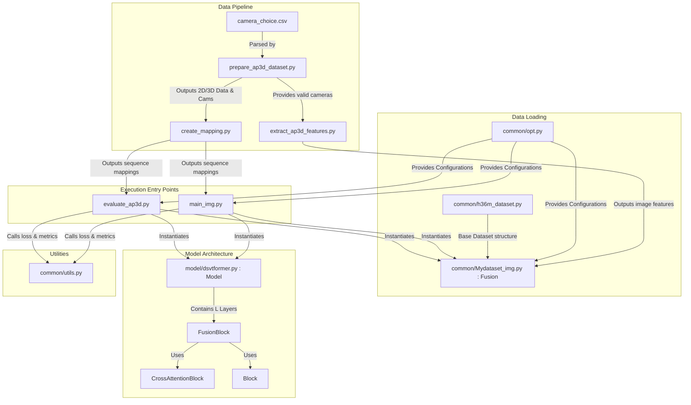

# DSVTformer Codebase Callgraph

This document provides a clear callgraph for the DSVTformer repository and explains the core functionality of each component (Node) and their interactions (Edges).

## Callgraph Diagram

---

## Node Explanations (Functionality)

### Execution Entry Points
*   **`main_img.py`**: The primary execution script for both training and testing the DSVTformer. It initializes the dataset, builds the model, handles the training loop (optimizer, loss calculation), and executes the evaluation loop (computing MPJPE and PA-MPJPE metrics).
*   **`evaluate_ap3d.py`**: An auxiliary standalone script specifically tailored to evaluate the model purely on the AP3D dataset. It contains logic to filter out non-key frames and correctly separate standard actions from their corresponding error (`_error`) trials. *(Note: This logic is also integrated into `main_img.py` when using `--dataset ap3d`)*.

### Data Pipeline
*   **`camera_choice.csv`**: A user-provided configuration file containing the optimal camera view combinations (e.g., ~90° angles) for each specific subaction sequence.
*   **`prepare_ap3d_dataset.py`**: Reads `camera_choice.csv` to dynamically select sequence-specific camera pairs. It parses raw AP3D data and generates the baseline 2D bounding boxes, 3D ground truth, and camera selection metadata (`ap3d_cameras.pkl`).
*   **`create_mapping.py`**: Creates a unified dictionary (`ap3d_mapping.pkl`) that maps AP3D internal subject and action names to the CSV-provided subaction definitions. This allows the evaluator to accurately filter metric calculations solely to key-frames.
*   **`extract_ap3d_features.py`**: Extracts 2D image features using a frozen Cascade Pyramid Network (CPN). It reads the camera combinations generated by the prepare script and runs feature extraction across synchronized video frames, outputting the features required by the DSVTformer's image stream.

### Data Loading
*   **`common/opt.py`**: The central configurations and arguments parser. It initializes and provides all hyper-parameters (e.g., learning rate, layers, embedding dimensions, test subjects) dynamically.
*   **`common/h36m_dataset.py`**: Contains base PyTorch Dataset implementations (`Human36mDataset`, `AP3DDataset`). It handles loading the raw 3D pose ground truths from disk.
*   **`common/Mydataset_img.py`**: Contains the highly specific `Fusion` PyTorch Dataset class. It handles temporal padding/cropping, concatenates 2D pose coordinates with their corresponding CPN image features, and orchestrates how batches of multi-view sequence data are fed into the network.

### Model Architecture (`model/dsvtformer.py`)
*   **`Model`**: The root DSVTformer architecture. It sets up the spatial, view, and temporal embeddings for both the Pose Stream and the Image Stream.
*   **`FusionBlock`**: The core architectural component. It orchestrates the explicit decomposition of Spatial-View-Temporal (SVT) correlations through sequential routing.
*   **`CrossAttentionBlock`**: Enables bidirectional interaction across streams (Pose-to-Image and Image-to-Pose). It allows 2D geometric data to gather rich semantic context from image features, and vice versa.
*   **`Block`**: A standard self-attention Transformer block used for intra-modal enhancement (e.g., smoothing temporal pose data).

### Utilities
*   **`common/utils.py`**: A helper library that provides core mathematical functions and metric calculators, such as `mpjpe_cal` (Mean Per Joint Position Error), Procrustes Alignment (`p_mpjpe`), and action-wise metric aggregation logic (`test_calculation`).

---

## Edge Explanations (Interactions)

*   **`CSV` $\rightarrow$ `Prep`**: The preparation script parses the raw CSV file to understand which cameras must be used for each trial.
*   **`Prep` $\rightarrow$ `Map` & `Ext`**: The baseline generated files dictating which cameras are used dictates how the mapping resolves names and tells the feature extractor which MP4 views to process.
*   **`Ext` $\rightarrow$ `FusionDS`**: The CPN image features generated are directly loaded by the `Fusion` dataset loader during the `__getitem__` call.
*   **`Opt` $\rightarrow$ Everything**: Options dictate whether the script is in training/testing mode, which dataset classes to instantiate, and what dimensions to build the model with.
*   **`H36mDS` $\rightarrow$ `FusionDS`**: `Fusion` uses the base dataset to fetch the ground truth 3D skeleton for the requested frame index before enriching it with 2D and image features.
*   **`Main` $\rightarrow$ `DSVT` & `FusionDS`**: The main execution orchestrator initiates the data loader queue and passes the resulting batches into the Model graph.
*   **`DSVT` $\rightarrow$ Blocks**: The global model sequentially passes tensors down $L$ `FusionBlocks`, which internally route the tensors through specific Self-Attention (`Block`) and Cross-Attention (`CrossAttentionBlock`) modules.
*   **`Main` $\rightarrow$ `Utils`**: Once the model outputs a predicted 3D pose tensor, `main_img.py` calls the utility metrics to calculate loss (during training) or MPJPE averages (during testing) against the `out_target` ground truth tensors.
